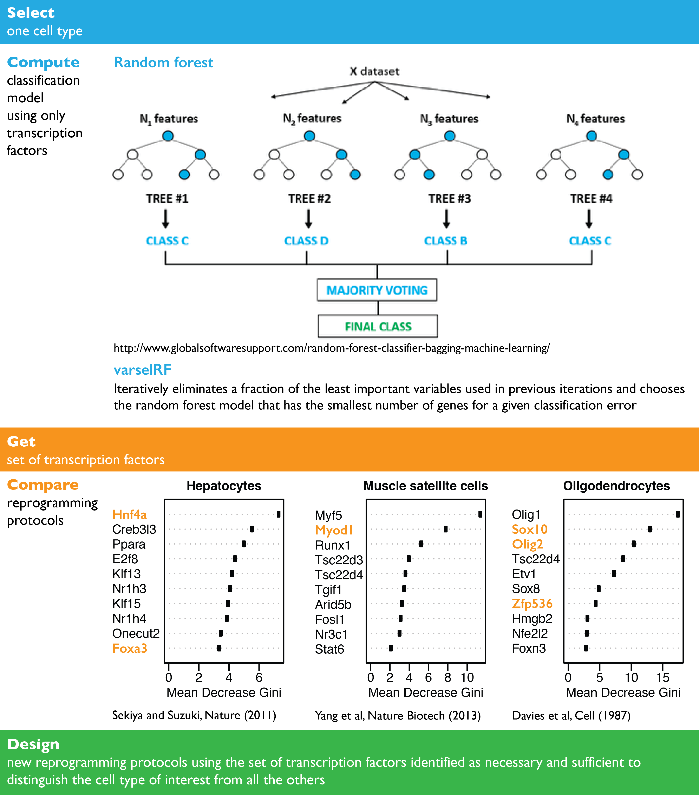

# How can scRNA-seq inform the development of new reprogramming protocols and sorting markers pannels?

## From transcription factors to reprogramming protocols
[Induced pluripotent stem cells](https://www.eurostemcell.org/ips-cells-and-reprogramming-turn-any-cell-body-stem-cell) are the holy grail of regenerative medicine; however, the low efficiency of somatic cell reprogramming and the lengthy cell differentiation protocols are hardening their potential clinical applications {add references}. For this reason, one of the current major goals of single cell research is defining cell identities because there lies the key to the development of better reprogramming protocols. Critical to such work is the understanding of the underlying regulatory networks. While a handful of molecular functions are usually associated with cell regulation, the most commonly used are transcription factors or transcription regulators in general. In [Tabula muris](https://www.nature.com/articles/s41586-018-0590-4) we investigated how transcription factors are able to reconstruct known cell ontology relationships between cell populations. Using a random forest model strategy we [identified sets of transcription factors](spreedsheet with tfs) that can potentially be used to inform the design of novel reprogramming protocols.

## Contribution of transcription factors to cell identity
Our confidence in the model comes from empirical validation, when comparing the top 10 candidates with the transcription factors currently used to reprogram some of the cell types. The choice of using transcription factors to pull each cell type a part from the rest was natural given that using only transcription factors we were able to reconstruct the full dendrogram of cell identities with 90\% confidence

in contrast with many other chosen functional groups.

## Cell surface markers
While it is of note the inability of cell surface markers to pull cell types apart, the cell surface antigens are among the most ubiquitous class of proteins used on daily basis in any cell biology lab. The majority of cell surface markers are molecules within cell's plasma membrane that are unique to different cell types. We sought to try using the random forest model used for identifying transcription factors associated with individual cell identities to come up with cell [surface markers panels](spreedsheet) that could be used to sort cells.

## Seeking collaborations
We would like to experimental validate the model results so if you are willing to test the transcription factors or cell surface markers candidates reach out to us.

 *Angela Oliveira Pisco on the behalf of the Tabula muris consortium* 

